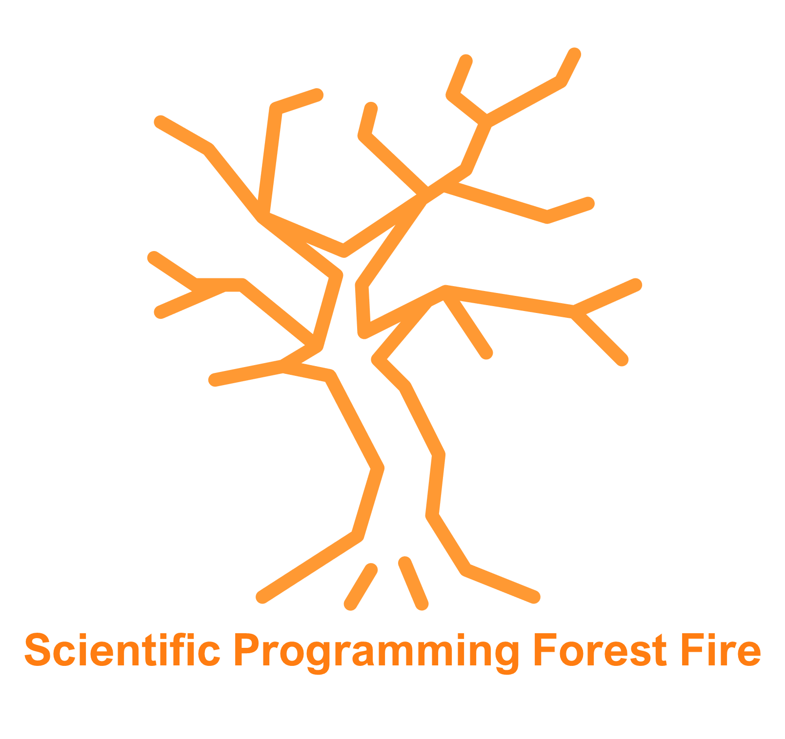

  

# Scientific Programming Forest Fire Simulation Coursework 2021

>_All code written here is my own work_
>_By <b>William D'Alessandro<b>_

---

## How to run this project

### Setting up

To run this code, simply set your working directory to '~\Scientific_Programming_Coursework\Scripts'.  
Next, using Ubuntu, turn your terminal to one which can interpret BASH scripts, this is often done by simply typing BASH into the cmd terminal itself.
You will then see green and blue text, in place of the white text. You may be missing some of the required packages, to install them simply follow the on screen sudo commands, as BASH will tell you the prompts to install these.

--

## Running the simulation

This project is designed to be as user-friendly as possible, and as such
a single BASH command will not only run both simulations together, but will also carry out all the data analysis. The outputted files will then be time stamped and stored in a specific output folder. You will get one output directory per full run through, containing one sub-directory per simulation. Each of these sub-directories will then contain four output folders. The output folders are as follows:

* Animation
    The animation of this simulation.

* Dataframes
    A .csv file containing the percentages of each cell type at each time step

* Graphs
    The graph plotted for the simulation

* NPZ_File
    The dataframe in a .npz format

Now to actually run these simulation, you have two optional parameters. These specify, in order, the array size, and the amount of time steps. These are specified after the command to run the simulations, as such: <b>bash Simulation_Generation.sh 'Array Size' 'Time Steps'</b> Please note, you will not type Array Size or Time Steps, simply enter numerical values. For example, <b>bash Simulation_Generation.sh 100 2000</b> will make an array with the dimensions 100\*100, ands then perform 2000 time steps. However, if you choose to not enter values, the project will default to an array of 50\*50, and 1000 time steps.

