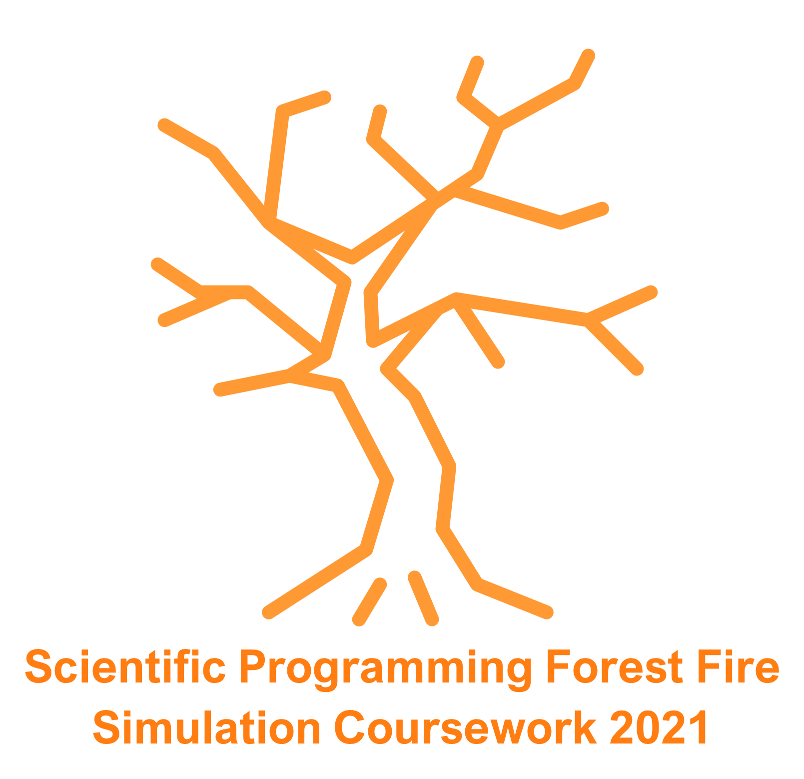

  

<head>
</head>

<main>

<body>

<h1>
 Scientific Programming Forest Fire Simulation Coursework 2021
</h1>
<i>
<p1  text-indent: 50px; color: "grey";>
All code written here is my own work
 By <b>William D'Alessandro<b></i>
</p1>

<article>
    <h2>
        How to run this project
    </h2>
    <p2>
        To run this code, simply set your working directory to '~\Scientific_Programming_Coursework\Scripts'.
        Next, using Ubuntu, turn your terminal to one which can interpret BASH scripts, this is often done by simply typing BASH into the cmd terminal itself.
        You will then see green and blue text, in place of the white text. You may be missing some of the required packages, to install them simply follow the on screen sudo commands, 
        as BASH will tell you the prompts to install these.
    </p2>
</article>

</body>

</main>